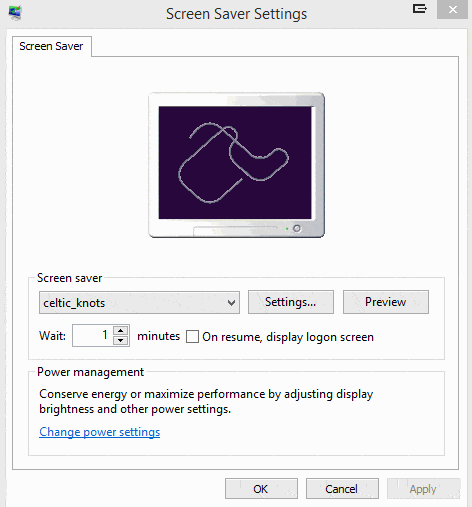

# Celtic Knots

Celtic Knots is a Windows screen saver I wrote in C++ some number of years ago.
The code hasn't been cleaned up at all, but I'm releasing it in the hope that
someone may find it interesting.

The code is released open-source under the GNU General Public License version 3.

The screen saver generates and animates random Celtic knots. These knots have
the property that each ribbon alternates between passing over and under each
ribbon it crosses. No ribbon will cross over twice or under twice in a row.
This is enforced using a novel grid-based knot generating algorithm.

The curves are calculated using [Cubic Hermite
splines](http://codeplea.com/introduction-to-splines). The file *spline.hpp* is
self-contained and may be of use to someone needing spline calculations. The
finial knot geometry is rendered using OpenGL.

# Demo

